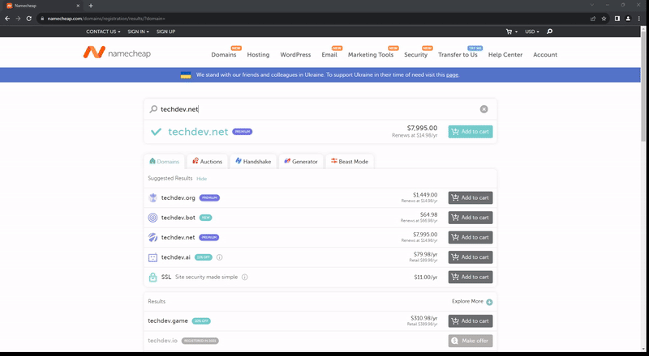

# CompanyScope Analyzer
[](https://www.buymeacoffee.com/skysoulkeeper)

## Overview
This script is designed to automate the process of checking the availability of company names and associated domains. It simplifies the task of verifying these details across various platforms.
- **Latest Stable Version:** [Main Branch](https://github.com/skysoulkeeper/CompanyScopeAnalyzer/tree/main)
- **Latest Changes:** [Develop Branch](https://github.com/skysoulkeeper/CompanyScopeAnalyzer/tree/develop)
- **At present, the script supports the following 6 state portals:**
  - __Florida (FL), Georgia (GA), South Carolina (SC), North Carolina (NC), Maryland (MD), New Jersey (NJ)__

## Table of Contents
1. [Overview](#overview)
2. [Visual Demo](#visual-demo)
3. [Features](#features)
4. [Installation](#installation)
5. [Usage](#usage)
6. [How It Works](#how-it-works)
7. [To Do or Not To Do](#to-do-or-not-to-do)
8. [Development and Contribution](#development-and-contribution)
9. [Acknowledgments](#acknowledgments)
10. [License](#license)
11. [Contact](#contact)
12. [Support](#support)
13. [Disclaimer](#disclaimer)

## Visual Demo


## Features
- __Company Name Availability Check:__ Determines whether a company name is available or already taken on state Portal.
- __Domain Name Availability Check:__ Checks the availability of any domains for the company names on NameCheap.
- __Configurable Checks:__ Allows enabling or disabling the company name and domain name checks via configuration settings.
- __Proxy Support:__ Provides the ability to configure and use proxy settings for enhanced web scraping and privacy.
- __Command-Line Argument Support:__ Added support for parsing command-line arguments to customize the execution of the script.
- Generates a report with the availability status of each company and domain name.

- **Supported formats:**
  - Input: txt
  - Output: xls, xml, json, csv, sql, txt
  - Report Output Example:
  - xls

  

  - xml

  

  - json
    ```json
        {
            "Company": "Tech Dev LLC",
            "State": "NJ",
            "BNS status": "Available",
            "Domains": {
                "techdev.com": "Taken",
                "techdev.net": "Available at $7,995.00",
                "techdev.tech": "Available at $9.97/yr"
            }
        }
    ```

  - csv
    ```
    Company,State,BNS status,.com,.net,.tech
    Binary Tech LLC,NJ,Not Available,Taken,Taken,Available at $9.97/yr
    Tech Dev LLC,NJ,Available,Taken,"Available at $7,995.00",Available at $9.97/yr
    ```

  - sql
    ```sql
    INSERT INTO companies (name, state, BNS, com, net, tech) VALUES ('Binary Tech LLC', 'NJ', 'Not Available', 'Taken', 'Taken', 'Available at $9.97/yr');
    INSERT INTO companies (name, state, BNS, com, net, tech) VALUES ('Tech Dev LLC', 'NJ', 'Available', 'Taken', 'Available at $7,995.00', 'Available at $9.97/yr');
    INSERT INTO companies (name, state, BNS, com, net, tech) VALUES ('Code Cyber LLC', 'NJ', 'Available', 'Taken', 'Available at $11.18/yr', 'Available at $9.97/yr');
    ```

  - txt
    ```
    Company: Tech Dev LLC
    State: NJ
    BNS status: Available
    techdev.com: Taken
    techdev.net: Available at $7,995.00
    techdev.tech: Available at $9.97/yr
    ```

## Installation
- To run this script, you need to have Python installed on your system along with the necessary packages:

Ensure you have **Python 3.8** or higher installed on your system.

1. **Clone the Repository:**

   ```bash
   git clone https://github.com/skysoulkeeper/CompanyScopeAnalyzer.git
   cd CompanyScopeAnalyzer
   ```

2. **Install Dependencies:**
   ```bash
    pip install -r requirements.txt
   ```

- This will install the specific versions of the selenium package and the webdriver-manager package, which are essential for running the script. The selenium package is used for automating web browser interaction, while webdriver-manager simplifies the management of binary drivers for different browsers.

## Usage
1. **Prepare the Input File:**
   - Create a text file named company.txt in folder __data__ containing the list of company names you want to check. Each company name should be on a new line.
2. **Set the Configuration:**
   - In the __[config.yml](configs/config.yml)__, modify the following lines to enable or disable specific checks:
```yaml
company_name_check_enabled: True
domain_check_enabled: True
domain_zones:
  - ".com"
  - ".net"
  - ".tech"
```
3. **Run the Script:**
   - Execute the script in your Python environment:
    ```bash
    python app.py
    ```

   - or

    ```bash
    python app.py --input data/input/company.txt --report-format xls --output data/reports
    ```

4. **Review the Results:**
   - Once the script finishes running, check the generated output file in folder __data/reports__ (e.g., __result_08_04_2023.txt__) for the availability status of each company and domain name.

## How It Works
- The script reads company names from the __data/input/company.txt__ file.
- For each company name, it formats the name appropriately for domain checking and state Portal search.
- If enabled, it checks the company name's availability on state Portal and logs the result as "Available," "Not Available," or "Status Unknown."
- If domain checking is enabled, the script checks for domain availabilities on NameCheap and logs the results.
- All results are written to an output file with a timestamp in the file name.

## Advanced Configuration
- Proxy Support

  - If you need to use a proxy:

      1.	Enable Proxy in [config.yml](configs/config.yml):
    ```yaml
    proxy_settings:
      proxy_enabled: False                              # Enable or disable proxy usage
      proxy_host: ""                                    # Proxy server IP address or hostname
      proxy_port: 1080                                  # Proxy server port number
      proxy_protocol: "socks"                           # Proxy protocol (e.g., "http", "https", "socks")
      proxy_username: ""                                # Username for proxy authentication
      proxy_password: ""                                # Password for proxy authentication
    ```

    2.	Supported Proxy Types:
    - HTTP, HTTPS, SOCKS4, and SOCKS5 proxies are supported.

## To Do or Not To Do
- Implement cflags functionality.
- Process lists from CSV, XLS, DOC, JSON.
- Add tests.
- Code and project structure optimization.
- Add support for business name searches in other states with a toggle feature.
- Create bots for Telegram, Slack, etc.
- Docker support.
- Implement asynchronous processing for faster results.
- Integrate Trade Mark checks.
- Generate company names dynamically.
- Develop a WebUI.
- Develop an API.

However, these enhancements might be considered in the future or perhaps in another lifetime.

## Development and Contribution
### Development
- **Testing Environments:**
  - Tested on Windows and macOS with Python version 3.11.
- **Purpose:**
  - Created to automate a tedious manual task.
- **Notes**
  - If you are not located in the United States, you may need to use a VPN or Proxy for the script to function correctly.
  - For the all portals exclude NJ, please specify the exact name of the prospective company. For example, use "APPLE LLC" or "APPLE INC." It is crucial to use the appropriate suffix for the company, such as LLC or INC. By default, a name without a suffix will be processed by appending LLC to it - for instance, "APPLE" will be treated as "APPLE LLC". If you explicitly provide "APPLE INC," then that exact company name will be processed. This specificity is due to the unique structure of some state portals. 🤷


### Contributing
We welcome contributions! Here’s how you can help:

- **Reporting Issues:**
  - Open an issue on GitHub if you find bugs or have feature requests.
- **Pull Requests:**
  - Fork the repository, make your changes, and submit a pull request.
  - Ensure your code follows the existing style and includes docstrings and comments.

## Acknowledgments
- **Libraries Used:**
  - **selenium** for browser automation.
  - **PyYAML** for parsing YAML files (used in configuration and localization).
  - **xlwt** for creating Excel files.
  - **loguru** for advanced logging capabilities.
  - **undetected-chromedriver** for bypassing bot detection in ChromeDriver.

## License
This project is licensed under the [MIT License](LICENSE). See the `LICENSE` file for details.

## Contact
For any questions or support, please contact:
- **Email:** [skysoulkeeper@gmail.com](mailto:skysoulkeeper@gmail.com)

## Support
If you like this project and want to support its development, consider buying me a coffee:

[](https://www.buymeacoffee.com/skysoulkeeper)

You can also support via:
- **PayPal 💸:** [Donate via PayPal](https://www.paypal.com/donate/?business=RC5EDUDFBPNCJ&no_recurring=0&currency_code=USD)
- **USDT (ERC20) 🪙:** `0xE157B1Ae65ee66B0c98D87829dC03f84DcfDed2d`
- **USDT (BEP20) 🪙:** `0xE157B1Ae65ee66B0c98D87829dC03f84DcfDed2d`
- **USDT (TRC20) 🪙:** `TAa9C6i8XYapJ1YsUZDxM5kyYiQ8YbL1TU`
- **BTC ₿:** `bc1qmkxklzc66tj0s3qzyww2jl9h5ul3a5mttlvylt`
- **ETH Ξ:** `0xE157B1Ae65ee66B0c98D87829dC03f84DcfDed2d`
- **DOGE 🐕:** `D5bsqM2dCSJpvS5XWy8RLHCmymwBYFZcan`

## Disclaimer
This bot is provided as-is. Feel free to download, modify, and use it as you see fit.

---
